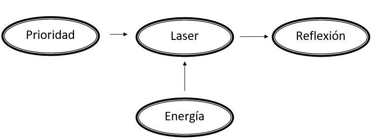
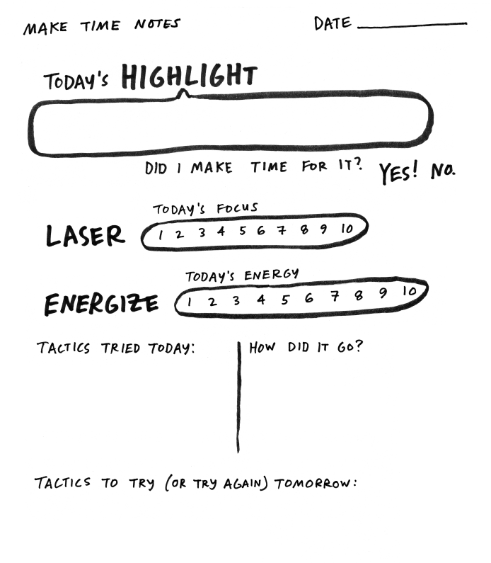

# Make Time (Jake Knapp y John Zeratsky)

#### Al comienzo del libro se explican dos conceptos claves para entender el motivo de la creación del libro:
**Efecto carroza**: Hacer las cosas por que el resto las hace. Únicamente debido a la presión de grupo. En el contexto del libro se refiere a que la tendencia actual de la sociedad es ser lo máximo productivo posible. Si no te sometes a la misma presión tienes una falsa sensación de estar "quedándote atrás". Te esfuerzas demasiado ya que es lo "normal", aunque eso te haga infeliz y te cause estrés.

**Piscinas infinitas**: Nos referimos con este término a cualquier fuente de distracciones que pueda actualizarse de forma infinita. Un ejemplo de piscina infinita seria 9gag, twiter, youtube, netflix etc. Cualquier fuente que pueda refrescarse o que tenga contenido prácticamente infinito.

## Prioridad

- Se debe escoger **una prioridad** diaria que sea el objetivo del día. Invertir tiempo en realizar esa prioridad es lo que hará que te sientas realizado. Irse a la cama sabiendo que lo que querías/debías hacer, lo has hecho, es lo que te provocará satisfacción.
- Hay que escoger bien las prioridades diarias en las que uno va a invertir su tiempo. Uno no recuerda días, uno recuerda momentos. Se debe invertir el tiempo en aquellas cosas que sean de verdad importantes por uno o por otro motivo. El tiempo realmente se pierde si no lo usas en hacer algo de forma intencionada. Si tu intención es jugar 4 horas al WOW hoy, y te tiras toda la tarde en ello, no estas perdiendo el tiempo.
- Para ser más productivo no hace falta atiborrar tu día de tareas y planificar todo al detalle. Añadir más tareas no hace que saques mas tiempo para lo que realmente te importa, solo hace que te sientas mas abrumado.
- Tu prioridad no será lo único que harás en tu día, pero si lo mas importante.

### 3 maneras para elegir tu prioridad
1. **Urgencia**. Escoger la prioridad diaria por que es algo que necesitas llevar a cabo hoy. Fechas limites.
2. **Satisfacción**. Elegir la prioridad por que es algo que realmente te aporta mas sensación de desarrollo personal. Como aprender un idioma, por ejemplo. Este tipo de tareas son las predispuestas a ser procrastinadas, ya que no son urgentes ni producen diversión a corto plazo.
3. **Diversión**. Las tareas que realmente te apetecen hoy, que mas te van divertir. ¿Qué es lo que haría que te lo pasaras mejor hoy?.

- Las tareas que se escojan como prioridad deben ser tareas ni muy cortas ni muy extensas. Elegir tareas que aproximadamente te lleven 1h o 1,5h en ser realizadas.
- Las prioridades se pueden cambiar perfectamente a lo largo del día. Esto no es un sistema rígido.

### Tácticas para llevar a cabo tu prioridad
- Anotar la prioridad en un post-it a primera hora del día o a última hora de la noche anterior.
- Si no realizas tu prioridad a la primera, no pasa nada. Anótala para repetirla al día siguiente.
- Puedes repetir prioridades para crear un hábito.
- Una forma de analizar tu prioridad es registrar al final del día como te fue consiguiendo ese objetivo.

### Tácticas interesantes para ganar tiempo
- Llevar un registro de tu proceso.
	1. Plan: Horario planeado para el dia.
	2. Realidad: Horario real que se consiguió finalmente.
	3. Revisión: Puntos a corregir para los siguientes días.
- Levantarse siempre a horas parecidas sea el día que sea. Esto hará tus ciclos de sueño mas eficientes y descansarás mejor.
- Dejar tu entorno de trabajo siempre impecable al final del día/jornada. Ayuda a empezar el día de 0, sin distracciones. Cerrar todas las pestañas del navegador, apagar el pc, dejar la mesa inmaculada.
- Planear el día siguiente la noche anterior. Empezar el día con un propósito y un horario ya establecido. Esto ayudará a no tener que divagar perdiendo el tiempo por la mañana.

## Laser

Cuanto mas tiempo pases realizando una tarea, mas inmerso estarás en ella y mejor trabajarás. Esto no solo se aplica a el tiempo que pases trabajando de forma seguida sin interrupciones, tambien se aplica a lo acostumbrado que estés a hacer esa tarea.
El ser humano tarda de media 23 min en volver a concentrarse en una tarea.
La música, ruido blanco etc, no ayuda en ningún caso. Lo único fiable es el silencio absoluto.

### Tácticas para mantener la concentración
- Poner barreas a las distracciones. Hacer log out de cualquier app o pagina en la que se este registrado. Tener que iniciar sesión conscientemente antes de distraerte.
- Quitar notificaciones innecesarias de las aplicaciones.
- Limpiar la pantalla principal del tlf. Evitar tenerla lleva de iconos de apps.
- Configurar el modo no molestar y poner que únicamente suenen las llamadas por si es una emergencia.
- Mejorar la concentración y las ganas de trabajar con ayunos de dopamina. Intentar evitar el mayor tiempo posible distracciones tras levantarse (evitar tlf, pantallas, xataca, etc). Luego resulta mas sencillo concentrarse.
- Apagar el ordenador al terminar dejando el navegador limpio. No hibernar.
- Usar bloqueadores de páginas web durante la jornada laboral.
- Identificar **cráteres de tiempo**. Pequeñas distracciones que al final del día hacen que pierdas mucho tiempo. Como 9gag.   

##### TV
- Intentar no orientar el salón hacia la tv. Que no sea el centro de atención sobre lo que todo este orientado.
- No hace falta siempre comer o cenar viendo series o películas. Recurrir a poner música tranquila y simplemente charlar.

#### General
- Llevar a cabo una rutina pre-trabajo para acostumbrarse a que lo siguiente que viene es concentrarse.
- Cerrar la puerta o ponerse cascos para evitar ruidos innecesarios.
- Inventar fechas límites para tus proyectos personales. Comprometerse con alguien para enseñarle o entregarse un proyecto antes de tenerlo terminado.
- Fragmentar las tareas en otras mas pequeñas siempre acompañas de un verbo. (**Diseñar** menús, **discutir** diseños, **programar** diseños, **enseñar** resultados.
- Dividir los hábitos con:
	1. Desencadenante. Siempre realizar la misma acción para empezar cierta actividad.
	2. Rutina o actividad a realizar.
	3. Recompensa.
- Se pueden usar temporizadores para el modo focus. De esta forma tienes un recordatorio visual de que deber estar concentrado.
- Recurrir a cosas sencillas para planificar y concentrarse. No hacer sobre-ingeniería. Un simple papel es tu mejor aliado.
- Apuntar todas las preguntas o pequeñas distracciones para buscarlas **luego** de la sesión de concentración. Ej: ¿Cuánto cuesta X cosa en Amazon?
- Realizar pequeñas sesiones de meditación/mindfullness antes de empezar el modo laser para mejorar la atención. Esta demostrado que ayuda a la concentración. Con 5 min es suficiente.
- Aburrete!. El ayuno de dopamina mejora tu cerebro y tu imaginación.
- Estáncate!. Cuando te atasques no te rindas o distraigas a la primera. Tampoco busques ayuda o la solución de forma inmediata. Concéntrate en la tarea y date la oportunidad de hacer trabajar tu cerebro antes de ver como se hace en otro lado.
- Si te sientes frustrado tomate el día libre. No tiene nada de malo descansar un día y desconectar.
- El entusiasmo en una tarea es la clave contra el agotamiento y mejora la concentración plena en algo. Mantente motivado.

## Energía

Como tener mas energía para estar a tope durante el día y realizar correctamente las tareas.

#### Principios básicos
1. Moverte!. Hacer ejercicio al menos 20-30 min al día es esencial. Te apetezca o no.
2. Comer verdaderos alimentos. Cuanto menos procesados mejor.
3. Optimizar la cafeína. Tomarla **antes** de tener sueño y saber evitarla fuera de ciertos horarios.
4. Desconectarse de aparatos eléctricos.

#### Tácticas para mejorar tu energía
- 20-30 min de ejercicio diarios. No siempre ponerse un podcast. Se pueden usar esos minutos para meditar y pensar. Existen también versiones de entrenamientos de 7 min de alta intensidad que pueden ser útiles para cuando se tiene menos tiempo.
- Evitar el azúcar todo lo que se pueda. El azúcar provoca subidas de azúcar, pero también bajadas posteriores que te dejan KO. Evitarlo en la medida de lo posible.
- Tomar un primer café entre 9:30-10:30 y la última taza de café entre la 1:30 y las 2:30. Ajustarlo de forma personal. Levantarse sin café. Los niveles de cortisona en una persona suelen estar en su punto mas alto sobre las 8-9 am. Eso debería bastar para mantenerse despierto.
- Intentar hacer siestas con café. Tomarse un buen café y echarse posteriormente una siesta de 15-30 min.
- Pasear 10 min por la naturaleza/parques ayuda con el estrés y la concentración (basado en estudios).
- No siempre tener auriculares o música. Dejar que tu cerebro descanse en silencio.

#### Social
- Intentar socializar al menos una vez a la semana. Pasar tiempo con otra gente ayuda a tu estado de ánimo y al estrés.
- Comer sin pantallas y hablar.

#### Dormir
- No usar dispositivos electrónicos antes de irse a dormir.
- Cuando anochezca usar luces suaves y encender las menos luces posibles para alentar el sueño y mandar a tu cerebro la señal de que es de noche.
- Por el contrario, por las mañanas poner las luces de forma mas intensa para fomentar despertarte.
- Dormir lo mas aislado posible. Antifaz y tapones.
- Intentar despertarse **siempre** a horas similares.

## Reflexión

Medir los resultados es tan importe como lograrlos. Tomar nota del proceso, modificar, ajustar y perfeccionar el método.
Al comenzar a aplicar las ideas de este libro se debe, **todos los días** llevar a cabo un registro de la siguiente forma.

